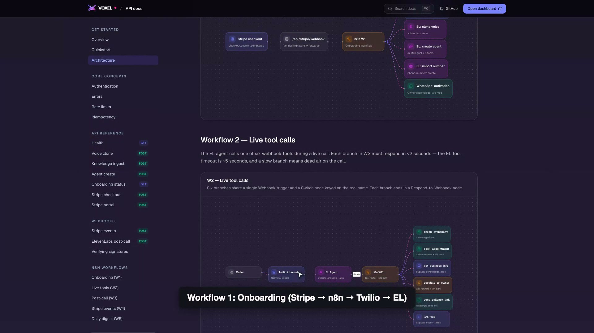
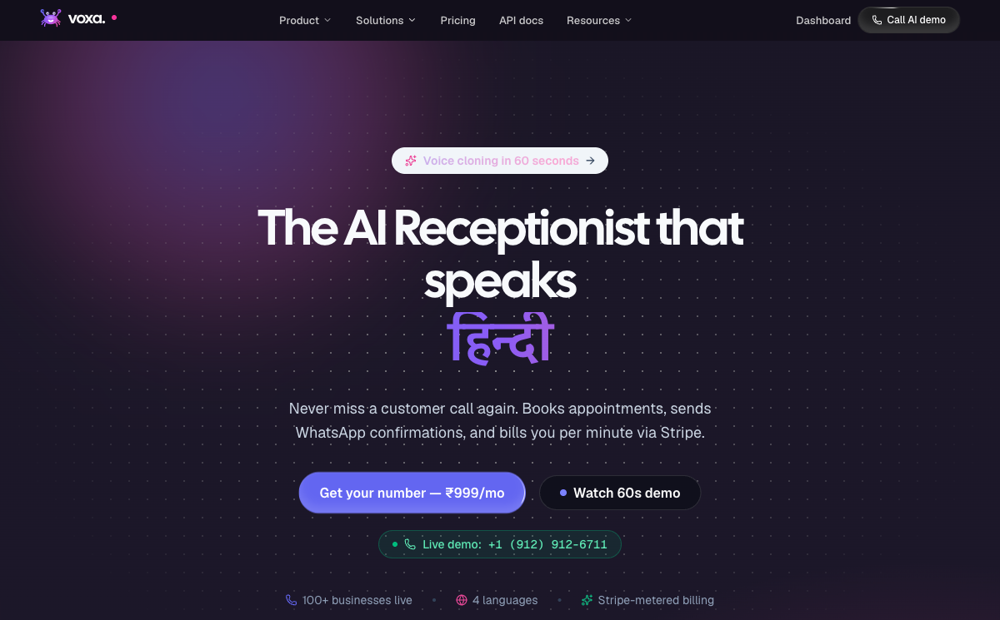
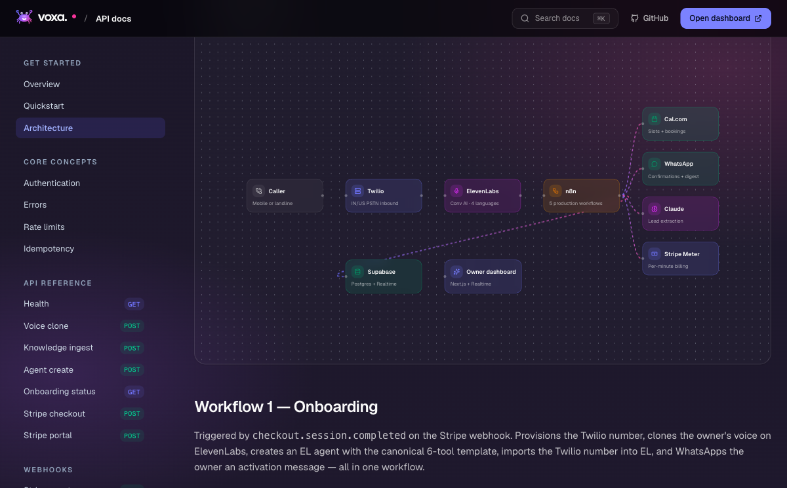
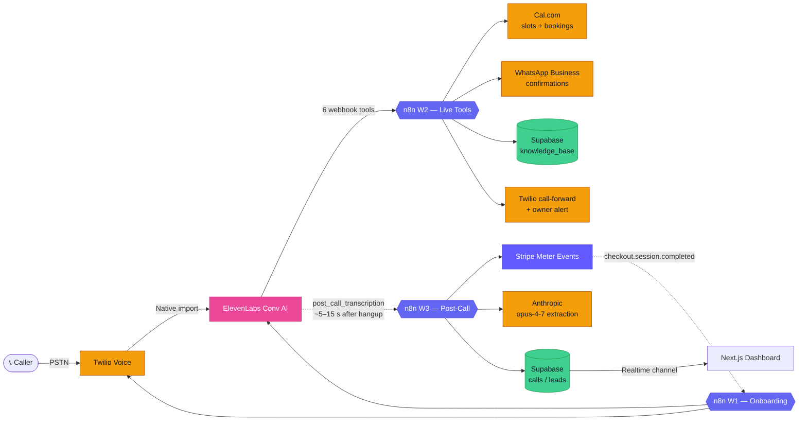
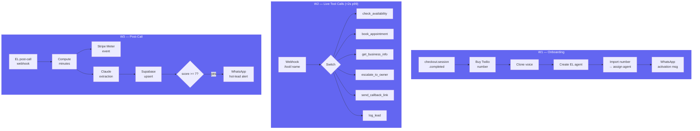
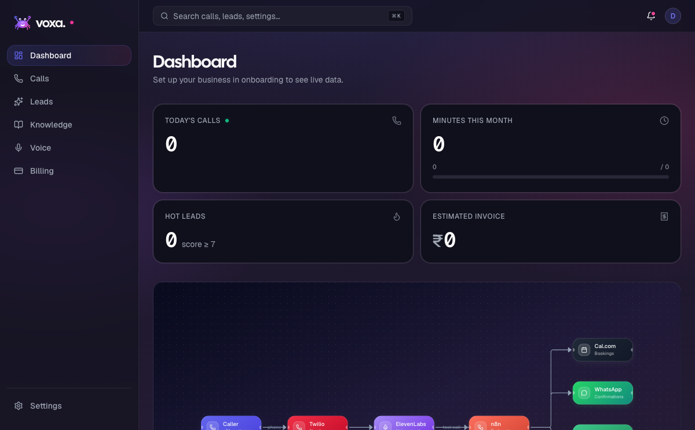
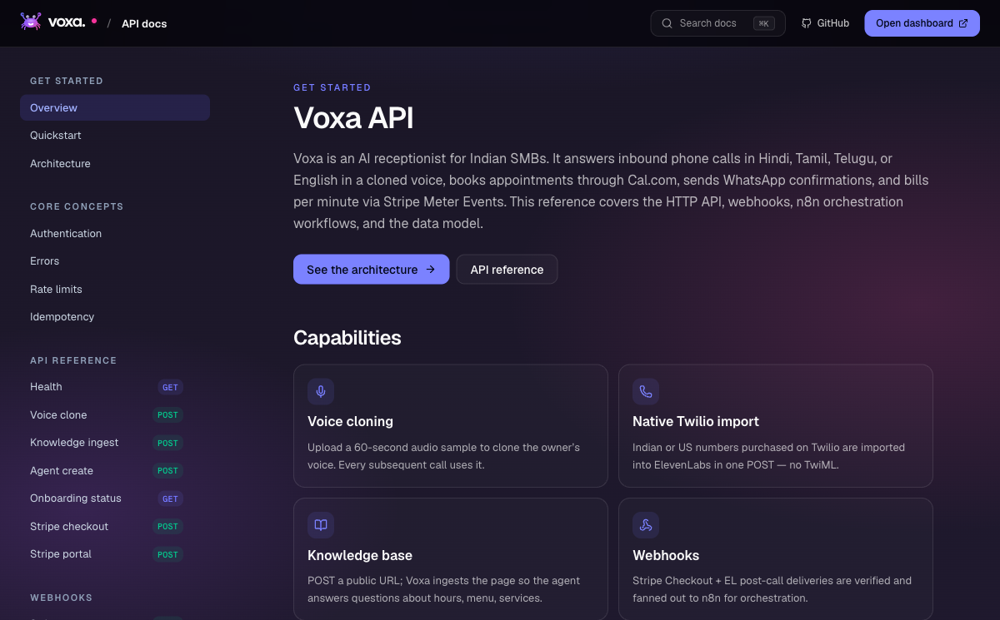
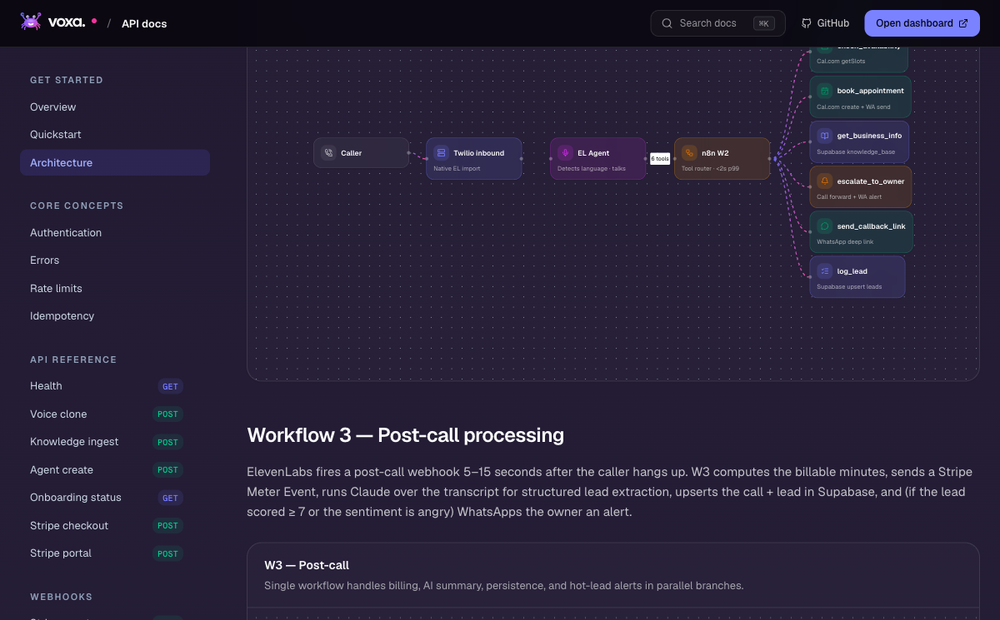
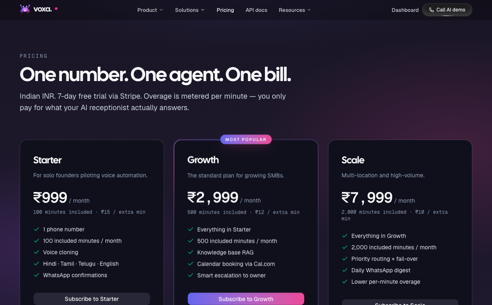

<div align="center">


# Voxa

### **The AI receptionist that picks up — in your voice, in your customer's language.**

Built for [`#ElevenHacks`](https://elevenlabs.io/hackathon) · ElevenLabs × Stripe · 2026

[](https://voxa-inky.vercel.app)
[_912--6711-10B981?style=for-the-badge)](tel:+19129126711)
[](#-license)


</div>

<br>

<div align="center">
  
</div>

<br>

> A small clinic in Bengaluru. A salon in Pune. A tutor in Hyderabad. Every day they lose customers because nobody picks up the phone after hours. Voxa picks up — in the owner's cloned voice, in the caller's language, every time.

---

## 🎬 See it. Hear it. Call it.

| | |
|---|---|
| 📞 **Live phone demo** | [`+1 (912) 912-6711`](tel:+19129126711) — call from any phone. The AI answers in Hindi/Tamil/Telugu/English. |
| 🌐 **Production site** | <https://voxa-inky.vercel.app> |
| 📚 **API docs** | <https://voxa-inky.vercel.app/docs> · with interactive React Flow architecture diagrams |
| 🎙 **Agent ID** | `agent_1501ks3dxeg6f489ksmqvd9hs8gz` (Sharma Dental Clinic persona, Hindi primary) |
| 🎬 **Demo video** | 87s master · 1920×1080 · burned-in captions · see [`docs/demo-video-README.md`](docs/demo-video-README.md) |

---

## 🪄 What Voxa does

<div align="center">
  
</div>

### Six capabilities, end-to-end

| | |
|---|---|
| 🎙 **Voice cloning** | A 60-second sample of the owner's voice → ElevenLabs IVC. Every subsequent call sounds like *them*. |
| 🌐 **Multilingual auto-switch** | Detects the caller's language on the first utterance. Locks to it for the rest of the call. Tamil-only and Telugu-only rules baked into the prompt. |
| 📞 **Native Twilio import** | The agent is plugged into the phone line via the ElevenLabs Phone Numbers API. No custom TwiML. Less than 60 seconds from Stripe Checkout to a ringing number. |
| 📅 **Cal.com bookings** | The agent calls real availability slots and creates real bookings via 6 webhook tools wired through n8n. |
| 💬 **WhatsApp confirmations** | Twilio Business sandbox sends booking confirmations + hot-lead alerts. |
| 💳 **Stripe Meter billing** | The new Stripe **Meter Events API** (2025-03-31 release) handles per-minute usage billing. Three tiers, flat licensed price + metered overage. |

---

## 🏗 Architecture

<div align="center">
  
</div>

### High-level data flow



### The 5 n8n workflows



> **W4 — Stripe events** (subscription deletes + invoice failures) and **W5 — Daily Digest** (6 PM IST cron, WhatsApp summary per business) round out the orchestration.

---

## 📞 The 6 webhook tools

The ElevenLabs agent calls these during a live call. Each branch must complete in **&lt;2s** (EL's tool timeout is ~5s).

| Tool | Args | Backend action |
|---|---|---|
| `check_availability` | `date`, `time_window` | Cal.com `getSlots` → returns 2 specific times |
| `book_appointment` | `customer_name`, `customer_phone`, `datetime_iso`, `service` | Cal.com `createBooking` + Twilio WhatsApp confirm + Supabase `leads` insert |
| `get_business_info` | `query` | RAG over `knowledge_base` (URL-ingested content) |
| `escalate_to_owner` | `reason`, `urgency: 'low' \| 'high'` | Twilio call-forward TwiML update + WhatsApp owner alert |
| `send_callback_link` | `customer_phone`, `link_type` | Twilio WhatsApp deep-link |
| `log_lead` | `customer_name`, `customer_phone`, `intent`, `notes` | Supabase `leads` upsert |

---

## 🖥 Product tour

### Dashboard with live React Flow orchestration

<div align="center">
  
</div>

The centerpiece of the demo video: a React Flow graph of every external service. Edges animate in real-time as Supabase Realtime pushes new `calls`, `leads`, and `meter_events` rows.

### Stripe-style API docs

<div align="center">
  
</div>

Three-column docs shell at <https://voxa-inky.vercel.app/docs> — sidebar nav with method badges, language-tabbed code samples (curl / Node / Python), interactive React Flow architecture diagrams. Built with the design philosophy of [docs.stripe.com](https://docs.stripe.com).

### Live tool-call workflow visualisation

<div align="center">
  
</div>

### Pricing — 3 tiers × 2 prices each

<div align="center">
  
</div>

| Tier | Flat / month | Included min | Overage / min |
|---|---|---|---|
| Starter | **₹999** | 100 | ₹15 |
| **Growth** ⭐ | **₹2,999** | 500 | ₹12 |
| Scale | **₹7,999** | 2,000 | ₹10 |

All Stripe-side: 1 Meter (`call_minutes`, `sum` aggregation) + 3 Products + 6 Prices, created idempotently via `pnpm setup:stripe`.

---

## 🛠 Tech stack

| Layer | Tools |
|---|---|
| **Frontend** | Next.js 15 (App Router, RSC, server actions) · React 19 · TypeScript strict · Tailwind v4 · shadcn/ui (slate) · Magic UI (18 components) · Motion · React Flow · Tremor · cmdk · Vaul · Wavesurfer · react-parallax-tilt |
| **Data** | Supabase Postgres (7 tables + RLS) · Supabase Realtime · Service-role + cookie-based clients |
| **Voice** | ElevenLabs Conversational AI · Instant Voice Cloning · Native Twilio Phone Numbers API |
| **Billing** | Stripe Meter Events API (`2025-03-31.basil`) · Stripe Checkout · Stripe Customer Portal · Idempotency table |
| **Telephony** | Twilio Voice (Indian / US numbers with auto IN→US fallback) · Twilio WhatsApp Business sandbox |
| **AI** | Anthropic `claude-opus-4-7` for post-call lead extraction (intent, sentiment, lead score) |
| **Orchestration** | n8n self-hostable + cloud (5 production workflows) · Cal.com for booking slots |
| **Infra** | Vercel (production) · Supabase Cloud · Anthropic API · ElevenLabs API |
| **Brand** | Cal Sans (headlines) · Geist Sans (body) · Geist Mono (code) · indigo `#6366F1` → pink `#EC4899` gradient |

---

## 🚀 Quick start

```bash
# Clone
git clone https://github.com/Sushant6095/voxa-stipeXelevenlabs.git voxa
cd voxa
pnpm install

# Add env vars (see docs/env-setup.md for the 25-min walkthrough)
cp .env.example .env.local
# Edit .env.local — paste keys from Supabase, Stripe, Twilio, EL, Anthropic, n8n

# Apply schema + provision Stripe + create EL agent + buy a phone number
pnpm setup:stripe          # Meter + 3 Products + 6 Prices
pnpm db:push               # 2 SQL migrations to Supabase
pnpm db:types              # regen lib/supabase/types.ts
pnpm setup:el-agent --business-name "Your Business" --language hi --voice-id <id> --n8n-url <url> --write-env
pnpm test:telephony <agent-id> --country=US   # buys + assigns a number

# Verify
pnpm smoke                 # 6 read-only checks across Supabase, Stripe, EL, Twilio, n8n, Anthropic

# Dev
pnpm dev                   # turbopack — http://localhost:4321

# Production
pnpm build && vercel --prod
```

Full walkthrough: [`docs/env-setup.md`](docs/env-setup.md).

---

## 📦 Project structure

```text
voxa/
├── app/
│   ├── (marketing)/pricing/       # 3-tier pricing page (parallax + BorderBeam)
│   ├── (app)/                     # App shell — dashboard, calls, leads, knowledge, voice, billing, settings
│   ├── docs/                      # Stripe-style API docs with React Flow diagrams
│   ├── onboarding/                # 6-step post-checkout wizard
│   ├── api/
│   │   ├── stripe/{checkout,portal,webhook}/
│   │   ├── elevenlabs/webhook/
│   │   ├── voice/clone/
│   │   ├── agent/create/
│   │   ├── knowledge/ingest/
│   │   └── onboarding/{business,scrape,status}/
│   ├── layout.tsx                 # Fonts + ThemeProvider + Toaster
│   ├── page.tsx                   # Landing — hero + bento + pricing + marquee + FAQ + footer
│   └── icon.svg                   # Crab favicon
├── components/
│   ├── brand/voxa-logo.tsx        # The gradient crab mascot
│   ├── landing/                   # Hero, Bento, AnimatedBeam, Marquee, Footer, mega-menu Navbar
│   ├── docs/                      # Stripe-style docs primitives + React Flow wrapper
│   ├── dashboard/                 # KPI cards, Live Orchestration, Leads kanban, Recent Calls drawer
│   ├── onboarding/                # 6 step components — progress dots, voice recorder, etc.
│   ├── app/                       # Sidebar, TopBar
│   ├── cmdk/                      # ⌘K command palette
│   └── ui/                        # shadcn primitives + 18 Magic UI components
├── lib/
│   ├── stripe.ts                  # Meter Events helpers, apiVersion 2025-03-31.basil
│   ├── elevenlabs.ts              # Agent CRUD, voice clone, phone number import
│   ├── telephony.ts               # IN→US fallback + orphan number cleanup
│   ├── twilio.ts                  # Number purchase + WhatsApp/SMS
│   ├── n8n.ts                     # Workflow trigger wrapper
│   ├── agent-template.ts          # The 800-word multilingual system prompt
│   ├── agent-tools.ts             # 6 webhook tool definitions
│   ├── dashboard-data.ts          # All Supabase queries
│   ├── realtime.ts                # Realtime hooks
│   ├── optimistic-leads.ts        # useOptimistic kanban
│   └── supabase/{server,client,middleware,types}.ts
├── supabase/migrations/
│   ├── 0001_initial_schema.sql    # 7 tables + RLS + Realtime publication + helper fns
│   └── 0002_stripe_webhook_events.sql
├── n8n/
│   ├── 01-onboarding.json         # W1
│   ├── 02-live-tools.json         # W2 (6 branches)
│   ├── 03-post-call.json          # W3
│   ├── 04-stripe-webhooks.json    # W4
│   ├── 05-daily-digest.json       # W5
│   └── README.md
├── scripts/
│   ├── setup-stripe.ts            # Idempotent Meter + Products + Prices
│   ├── setup-elevenlabs-template.ts
│   ├── test-telephony.ts
│   ├── smoke-test.ts              # 6-check live API verification
│   ├── record-demo-video.cjs      # Playwright 5-shot tour
│   └── generate-narration.mjs     # ElevenLabs TTS for the 3 narration clips
├── docs/
│   ├── architecture.md
│   ├── env-setup.md               # 25-min key-collection walkthrough
│   ├── runbook.md
│   ├── ui-spec.md
│   ├── demo-video-README.md
│   └── images/                    # Screenshots used in this README
└── middleware.ts
```

---

## 🧪 What ships

| Inventory | Count |
|---|---|
| Production routes (200) | **17** (8 marketing/docs · 7 app · 2 onboarding flows) |
| API routes | **11** |
| Supabase tables | **8** (businesses, agents, subscriptions, knowledge_base, calls, leads, meter_events, stripe_webhook_events) |
| RLS policies | **15** |
| Stripe resources provisioned | **1 Meter · 3 Products · 6 Prices** |
| n8n workflow JSONs | **5** (80 nodes total, all validate) |
| ElevenLabs server tools | **6** |
| TypeScript errors | **0** (strict mode, project-wide) |
| Source files | **150+** |

---

## 💳 Try the live demo

Three ways, in increasing order of "wow":

1. **Browse:** open <https://voxa-inky.vercel.app> on any device. Tap **"📞 Call AI demo"** in the navbar.
2. **Call:** dial **+1 (912) 912-6711** from any phone, anywhere in the world. Try opening with Hindi, Tamil, or Telugu — the agent locks to your language.
3. **Inspect:** open <https://voxa-inky.vercel.app/docs/architecture> for the interactive React Flow walk-through of every workflow.

---

## 🎬 Demo video

Recorded automatically via `scripts/record-demo-video.cjs` — a 5-shot Playwright tour of the live site at 1920×1080 with burned-in captions.

| Aspect | File | Use for |
|---|---|---|
| 16:9 master | `voxa-demo-master.mp4` | Hackathon submission, YouTube, X main, LinkedIn |
| 9:16 vertical | `voxa-demo-vertical.mp4` | TikTok, Reels, Shorts |
| 1:1 square | `voxa-demo-square.mp4` | Instagram feed |

See [`docs/demo-video-README.md`](docs/demo-video-README.md) for the FFmpeg mux command to add ElevenLabs voice narration.

---

## 🏆 Built for #ElevenHacks

**50 hours. Two solo developers' worth of scope. Shipped.**

This repository is the entire product — backend, frontend, infrastructure, n8n workflows, deployment scripts, documentation site, and demo video pipeline. Every line was written during the ElevenLabs × Stripe hackathon weekend.

| Why this submission | |
|---|---|
| **Real product, real users** | A small-business owner could subscribe via Stripe Checkout, get a working phone number, and have customers calling within an hour. Not a toy. |
| **Deepest possible Stripe + EL integration** | Uses Stripe's brand-new (2025-03-31) Meter Events API for usage billing — *and* ElevenLabs' native Twilio import which is the recommended path, not a custom TwiML bridge. |
| **Voice cloning that matters** | The agent sounds like the *owner*, not a generic TTS. For a regional SMB customer who calls a familiar voice, this is the whole product. |
| **Multilingual is non-trivial** | The agent detects language on the first utterance and locks to it — Tamil-only callers don't get Hinglish, Telugu-only callers don't get Hindi. The system prompt is 800 words of regional language rules. |
| **Live, callable** | [`+1 (912) 912-6711`](tel:+19129126711). Judges can dial it from anywhere. |

---

## 📜 License

MIT — see [LICENSE](LICENSE).

---

<div align="center">

**Built by [@Sushant6095](https://github.com/Sushant6095) with help from Claude · 50 hours · ElevenHacks 2026**

[Live demo](https://voxa-inky.vercel.app) · [Call the AI](tel:+19129126711) · [API docs](https://voxa-inky.vercel.app/docs) · [Architecture](https://voxa-inky.vercel.app/docs/architecture)

</div>
